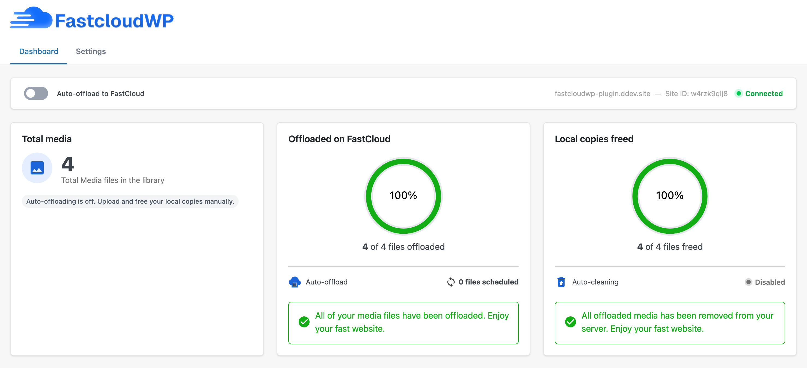

# FastCloudWP

> **Work in progress.** FastCloud is not yet publicly available, and this plugin is pending approval on the WordPress plugin directory. Stay tuned — it's coming.

FastCloudWP is a WordPress plugin that automatically offloads your media library to [FastCloud](https://fastcloudwp.com/) and serves every asset through a global CDN. Upload once, deliver everywhere — without changing how you work in WordPress.

## Why FastCloudWP?

WordPress sites accumulate media. That media lives on your server, slows down your stack, and costs you disk space. FastCloudWP moves it out of the way automatically and rewrites your frontend URLs so visitors get assets from the nearest CDN edge — faster, and with less load on your origin.

**No AWS. No IAM. No S3 buckets. No storage configuration.** Just create a FastCloud account, paste your sitekey into the plugin, and you're done. Everything else is handled for you — including a **5 GB free plan, forever**.

## Features

- **Automatic offloading** — New uploads are queued and sent to FastCloud immediately after processing.
- **CDN URL rewriting** — Frontend `src` and `srcset` attributes are rewritten on the fly to point to the CDN origin.
- **Batch offload** — Existing media can be offloaded in bulk from the admin dashboard.
- **Optional local deletion** — Free up disk space by removing local copies after offloading.
- **Offload status tracking** — Each attachment is tracked (`queued`, `pending`, `offloaded`) so you always know what's been moved.
- **WP-CLI support** — Offload media and free disk space from the command line, with progress bars.
- **Settings UI** — Clean Vue 3 admin interface to connect, configure, and monitor everything.

## Coming Soon

These features are on the roadmap and will ship after the initial release:

- **Image optimization** _(Pro)_ — Automatic WebP and AVIF conversion on upload. The single biggest PageSpeed Insights win for media-heavy sites.
- **WooCommerce support** — Full compatibility with product images and attachment URL rewriting for WooCommerce stores.
- **Delivery analytics** — Bandwidth served, cache hit rate, and top files. See exactly what your CDN is doing.
- **Agency plan** — Multi-site management, higher limits, and white-label options. [Join the waitlist](https://fastcloudwp.com/) to be notified first.

## WP-CLI

FastCloudWP includes two WP-CLI commands for managing your media from the command line.

**Offload all pending media:**

```bash
wp fastcloud offload
```

Queues all media files that have not yet been offloaded to FastCloud. Runs in batches and shows a progress bar. Stops automatically if your storage quota is exceeded.

**Delete local copies to free disk space:**

```bash
wp fastcloud free-space
```

Deletes the local files for all media that has already been offloaded. Requires the "Remove Local Copies After Offload" setting to be enabled. Runs in batches and shows a progress bar.

## Code Quality

This project follows the [WordPress JavaScript coding standards](https://developer.wordpress.org/coding-standards/wordpress-coding-standards/javascript/) and the [WordPress PHP coding standards](https://developer.wordpress.org/coding-standards/wordpress-coding-standards/php/).

- **PHP** — validated with [PHP_CodeSniffer](https://github.com/squizlabs/PHP_CodeSniffer) using the `WordPress` ruleset and [PHPCompatibility](https://github.com/PHPCompatibility/PHPCompatibility) for PHP 8.1+.
- **JavaScript / TypeScript** — linted with [ESLint](https://eslint.org/) using [`@wordpress/eslint-plugin`](https://developer.wordpress.org/block-editor/reference-guides/packages/packages-eslint-plugin/), which enforces WordPress i18n rules, valid `sprintf` usage, and correct text domain usage across all Vue and TypeScript source files.

Both checks run automatically on every push via GitHub Actions and must pass before any release is deployed.

## Requirements

- WordPress 6.1+
- PHP 8.1+
- A FastCloud account _(not yet publicly available)_

## Status

The plugin is functional and under active development. FastCloud itself is not open to the public yet. Once both are ready, installation will be as simple as searching "FastCloudWP" in the WordPress plugin directory.

If you're a developer and want to follow along or contribute, watch this repo.



---

License: [GPLv2](https://www.gnu.org/licenses/gpl-2.0.html)
